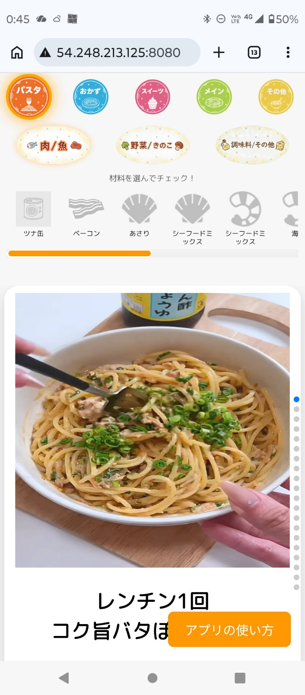
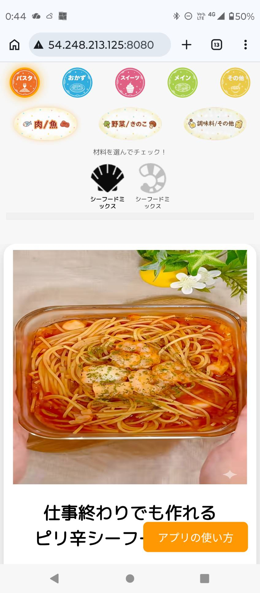
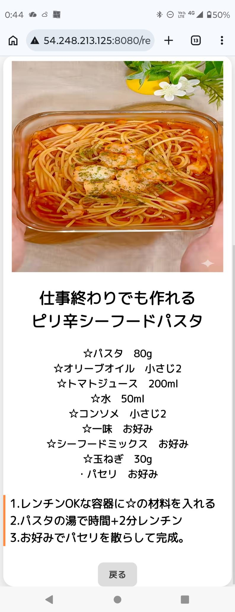

# Zubora Recipe App

「献立を考えるのが面倒」という悩みを解決する、スワイプ操作で直感的にレシピを選べるモバイル特化型Webアプリケーションです。

## 📱 アプリケーション画面
<table>
  <tr>
    <td></td>
    <td></td>
    <td></td>
  </tr>
</table>

## 🚀 サービスURL
**[http://54.248.213.125:8080/](http://54.248.213.125:8080/)** 
※※本アプリはモバイル利用に特化したUI/UXを優先して設計しております。
PCブラウザでご覧いただく際は、お手数ですがブラウザの「開発者モード（F12キー）」にて
スマートフォン表示に切り替えていただけますと、本来のデザインでご確認いただけます。
(参考：Google Chromeの場合、F12キーを押して Ctrl+Shift+M でデバイス切り替えが可能です)

## 🛠 使用技術スタック

### バックエンド
- **Java 21**
- **Spring Boot 3.2.x**
- **Spring Security**

### データベース / インフラ
- **MariaDB**
- **AWS (EC2)**
- **Docker** （移行・コンテナ化を計画中）

### フロントエンド
- **Thymeleaf** / **JavaScript**
- **HTML5 / CSS3** (レスポンシブ対応予定)

## ✨ こだわったポイント
1. **思考コストを最小化した、ストレスフリーな検索UX**
: 「献立を考えるのが面倒」というユーザー（ずぼらな人）の心理に寄り添い、文字入力の手間を一切排除し、直感的な**アイコンタップのみで完結する絞り込み検索**を実装しています。
2. **検索における「デッドエンド」の完全排除**
: JavaScriptを用いた動的なカテゴリ制御により、選択可能なレシピが存在しないアイコンをリアルタイムで非表示化。「検索結果0件」という負のUX（デッドエンド）を未然に防いでます。
3. **インフラの一気通貫な構築と運用**
: AWS（EC2）のプロビジョニングからネットワーク設定、デプロイまでを独力で完遂。単なる開発に留まらず、プロダクトを外部公開し運用するまでの一連のサイクルを経験しました。

## 📈 アップデート履歴 / 今後の予定
- [x] **セキュリティ強化**: 環境変数の導入により、機密情報（DBパスワード等）をソースコードから分離完了。
- [ ] **Dockerによるコンテナ運用**: マルチステージビルドを用いた軽量・安全なデプロイ環境の構築。
- [ ] **レスポンシブ対応**: メディアクエリを活用したPC版レイアウトの最適化。
